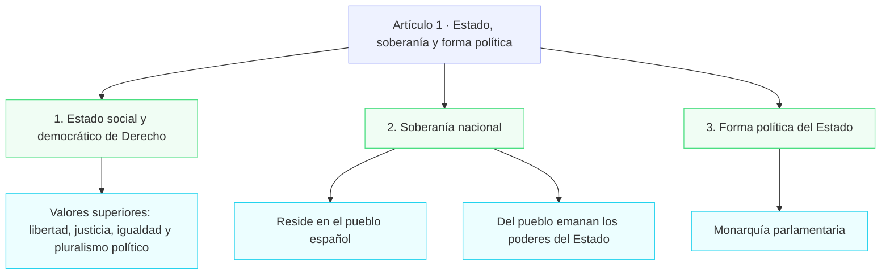
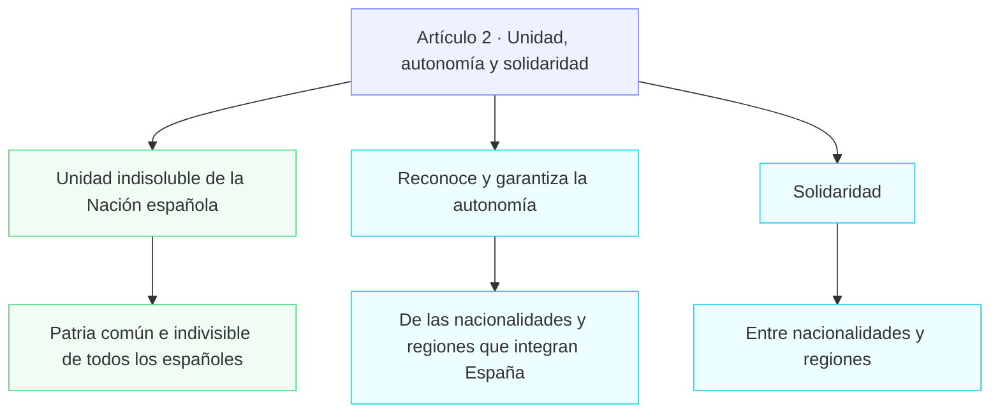
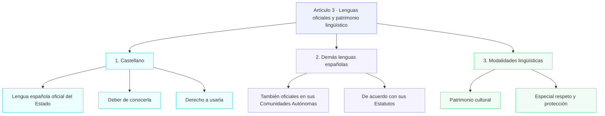
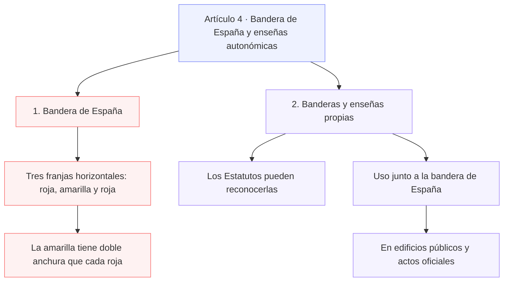
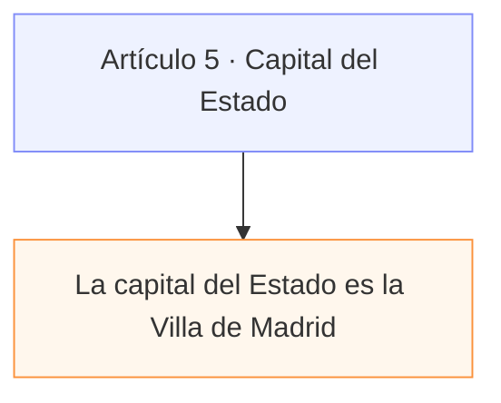
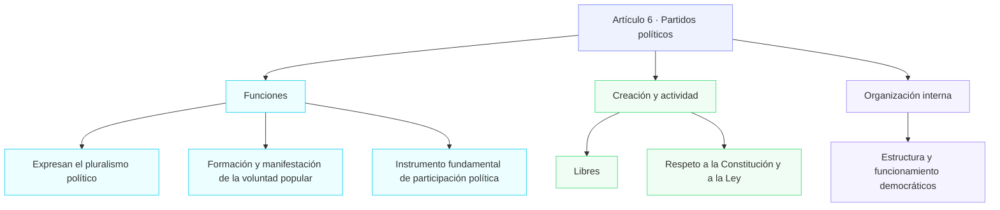
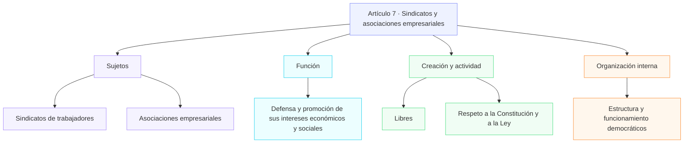
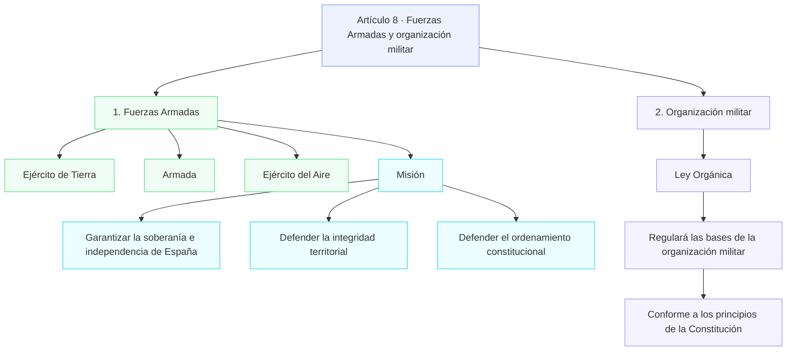
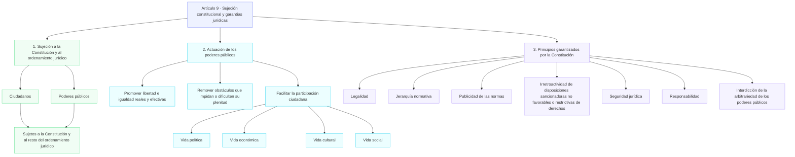

```mermaid
flowchart TD
    A1["Artículo 1 · Estado, soberanía y forma política"]
    A1 --> A11["1. Estado social y democrático de Derecho"]
    A1 --> A12["2. Soberanía nacional"]
    A1 --> A13["3. Forma política del Estado"]

    A11 --> A111["Valores superiores: libertad, justicia, igualdad y pluralismo político"]
    A12 --> A121["Reside en el pueblo español"]
    A12 --> A122["Del pueblo emanan los poderes del Estado"]
    A13 --> A131["Monarquía parlamentaria"]

    classDef article fill:#eef2ff,stroke:#818cf8
    classDef section fill:#f0fdf4,stroke:#4ade80
    classDef detail fill:#ecfeff,stroke:#22d3ee
    class A1 article
    class A11,A12,A13 section
    class A111,A121,A122,A131 detail
```

```mermaid
flowchart TD
    A2["Artículo 2 · Unidad, autonomía y solidaridad"]
    A2 --> A21["Unidad indisoluble de la Nación española"]
    A21 --> A211["Patria común e indivisible de todos los españoles"]
    A2 --> A22["Reconoce y garantiza la autonomía"]
    A22 --> A221["De las nacionalidades y regiones que integran España"]
    A2 --> A23["Solidaridad"]
    A23 --> A231["Entre nacionalidades y regiones"]

    classDef article fill:#eef2ff,stroke:#818cf8
    classDef unity fill:#f0fdf4,stroke:#4ade80
    classDef autonomy fill:#ecfeff,stroke:#22d3ee
    class A2 article
    class A21,A211 unity
    class A22,A221,A23,A231 autonomy
```

```mermaid
flowchart TD
    A3["Artículo 3 · Lenguas oficiales y patrimonio lingüístico"]
    A3 --> A31["1. Castellano"]
    A3 --> A32["2. Demás lenguas españolas"]
    A3 --> A33["3. Modalidades lingüísticas"]

    A31 --> A311["Lengua española oficial del Estado"]
    A31 --> A312["Deber de conocerla"]
    A31 --> A313["Derecho a usarla"]
    A32 --> A321["También oficiales en sus Comunidades Autónomas"]
    A32 --> A322["De acuerdo con sus Estatutos"]
    A33 --> A331["Patrimonio cultural"]
    A33 --> A332["Especial respeto y protección"]

    classDef article fill:#eef2ff,stroke:#818cf8
    classDef official fill:#ecfeff,stroke:#22d3ee
    classDef regional fill:#f5f3ff,stroke:#a78bfa
    classDef heritage fill:#f0fdf4,stroke:#4ade80
    class A3 article
    class A31,A311,A312,A313 official
    class A32,A321,A322 regional
    class A33,A331,A332 heritage
```

```mermaid
flowchart TD
    A4["Artículo 4 · Bandera de España y enseñas autonómicas"]
    A4 --> A41["1. Bandera de España"]
    A4 --> A42["2. Banderas y enseñas propias"]

    A41 --> A411["Tres franjas horizontales: roja, amarilla y roja"]
    A411 --> A412["La amarilla tiene doble anchura que cada roja"]
    A42 --> A421["Los Estatutos pueden reconocerlas"]
    A42 --> A422["Uso junto a la bandera de España"]
    A422 --> A423["En edificios públicos y actos oficiales"]

    classDef article fill:#eef2ff,stroke:#818cf8
    classDef national fill:#fef2f2,stroke:#f87171
    classDef regional fill:#f5f3ff,stroke:#a78bfa
    class A4 article
    class A41,A411,A412 national
    class A42,A421,A422,A423 regional
```

```mermaid
flowchart TD
    A5["Artículo 5 · Capital del Estado"]
    A5 --> A51["La capital del Estado es la Villa de Madrid"]

    classDef article fill:#eef2ff,stroke:#818cf8
    classDef capital fill:#fff7ed,stroke:#fb923c
    class A5 article
    class A51 capital
```

```mermaid
flowchart TD
    A6["Artículo 6 · Partidos políticos"]
    A6 --> A61["Funciones"]
    A6 --> A62["Creación y actividad"]
    A6 --> A63["Organización interna"]

    A61 --> A611["Expresan el pluralismo político"]
    A61 --> A612["Formación y manifestación de la voluntad popular"]
    A61 --> A613["Instrumento fundamental de participación política"]
    A62 --> A621["Libres"]
    A62 --> A622["Respeto a la Constitución y a la Ley"]
    A63 --> A631["Estructura y funcionamiento democráticos"]

    classDef article fill:#eef2ff,stroke:#818cf8
    classDef function fill:#ecfeff,stroke:#22d3ee
    classDef freedom fill:#f0fdf4,stroke:#4ade80
    classDef democracy fill:#f5f3ff,stroke:#a78bfa
    class A6 article
    class A61,A611,A612,A613 function
    class A62,A621,A622 freedom
    class A63,A631 democracy
```

```mermaid
flowchart TD
    A7["Artículo 7 · Sindicatos y asociaciones empresariales"]
    A7 --> A71["Sujetos"]
    A7 --> A72["Función"]
    A7 --> A73["Creación y actividad"]
    A7 --> A74["Organización interna"]

    A71 --> A711["Sindicatos de trabajadores"]
    A71 --> A712["Asociaciones empresariales"]
    A72 --> A721["Defensa y promoción de sus intereses económicos y sociales"]
    A73 --> A731["Libres"]
    A73 --> A732["Respeto a la Constitución y a la Ley"]
    A74 --> A741["Estructura y funcionamiento democráticos"]

    classDef article fill:#eef2ff,stroke:#818cf8
    classDef actors fill:#f5f3ff,stroke:#a78bfa
    classDef function fill:#ecfeff,stroke:#22d3ee
    classDef freedom fill:#f0fdf4,stroke:#4ade80
    classDef democracy fill:#fff7ed,stroke:#fb923c
    class A7 article
    class A71,A711,A712 actors
    class A72,A721 function
    class A73,A731,A732 freedom
    class A74,A741 democracy
```

```mermaid
flowchart TD
    A8["Artículo 8 · Fuerzas Armadas y organización militar"]
    A8 --> A81["1. Fuerzas Armadas"]
    A8 --> A82["2. Organización militar"]

    A81 --> A811["Ejército de Tierra"]
    A81 --> A812["Armada"]
    A81 --> A813["Ejército del Aire"]
    A81 --> A814["Misión"]
    A814 --> A8141["Garantizar la soberanía e independencia de España"]
    A814 --> A8142["Defender la integridad territorial"]
    A814 --> A8143["Defender el ordenamiento constitucional"]
    A82 --> A821["Ley Orgánica"]
    A821 --> A822["Regulará las bases de la organización militar"]
    A822 --> A823["Conforme a los principios de la Constitución"]

    classDef article fill:#eef2ff,stroke:#818cf8
    classDef armed fill:#f0fdf4,stroke:#4ade80
    classDef mission fill:#ecfeff,stroke:#22d3ee
    classDef law fill:#f5f3ff,stroke:#a78bfa
    class A8 article
    class A81,A811,A812,A813 armed
    class A814,A8141,A8142,A8143 mission
    class A82,A821,A822,A823 law
```

```mermaid
flowchart TD
    A9["Artículo 9 · Sujeción constitucional y garantías jurídicas"]
    A9 --> A91["1. Sujeción a la Constitución y al ordenamiento jurídico"]
    A9 --> A92["2. Actuación de los poderes públicos"]
    A9 --> A93["3. Principios garantizados por la Constitución"]

    A91 --> A911["Ciudadanos"]
    A91 --> A912["Poderes públicos"]
    A911 --> A913["Sujetos a la Constitución y al resto del ordenamiento jurídico"]
    A912 --> A913

    A92 --> A921["Promover libertad e igualdad reales y efectivas"]
    A92 --> A922["Remover obstáculos que impidan o dificulten su plenitud"]
    A92 --> A923["Facilitar la participación ciudadana"]
    A923 --> A9231["Vida política"]
    A923 --> A9232["Vida económica"]
    A923 --> A9233["Vida cultural"]
    A923 --> A9234["Vida social"]

    A93 --> A931["Legalidad"]
    A93 --> A932["Jerarquía normativa"]
    A93 --> A933["Publicidad de las normas"]
    A93 --> A934["Irretroactividad de disposiciones sancionadoras no favorables o restrictivas de derechos"]
    A93 --> A935["Seguridad jurídica"]
    A93 --> A936["Responsabilidad"]
    A93 --> A937["Interdicción de la arbitrariedad de los poderes públicos"]

    classDef article fill:#eef2ff,stroke:#818cf8
    classDef duty fill:#f0fdf4,stroke:#4ade80
    classDef action fill:#ecfeff,stroke:#22d3ee
    classDef principle fill:#f5f3ff,stroke:#a78bfa
    class A9 article
    class A91,A911,A912,A913 duty
    class A92,A921,A922,A923,A9231,A9232,A9233,A9234 action
    class A93,A931,A932,A933,A934,A935,A936,A937 principle
```