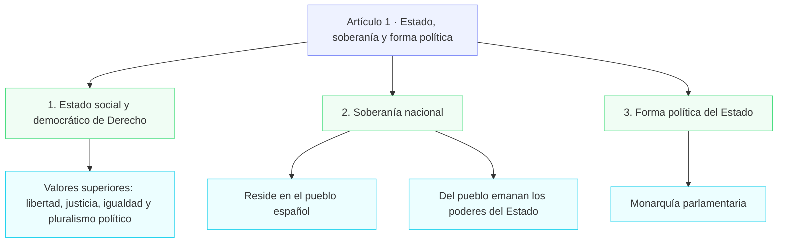

```mermaid
flowchart TD
    A1["Artículo 1 · Estado, soberanía y forma política"]
    A1 --> A11["1. Estado social y democrático de Derecho"]
    A1 --> A12["2. Soberanía nacional"]
    A1 --> A13["3. Forma política del Estado"]

    A11 --> A111["Valores superiores: libertad, justicia, igualdad y pluralismo político"]
    A12 --> A121["Reside en el pueblo español"]
    A12 --> A122["Del pueblo emanan los poderes del Estado"]
    A13 --> A131["Monarquía parlamentaria"]

    classDef article fill:#eef2ff,stroke:#818cf8
    classDef section fill:#f0fdf4,stroke:#4ade80
    classDef detail fill:#ecfeff,stroke:#22d3ee
    class A1 article
    class A11,A12,A13 section
    class A111,A121,A122,A131 detail
```