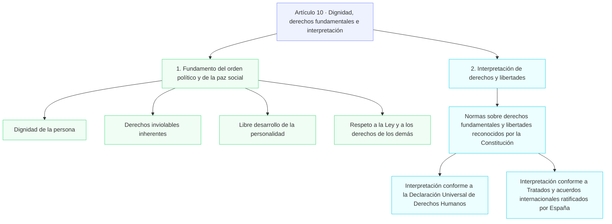
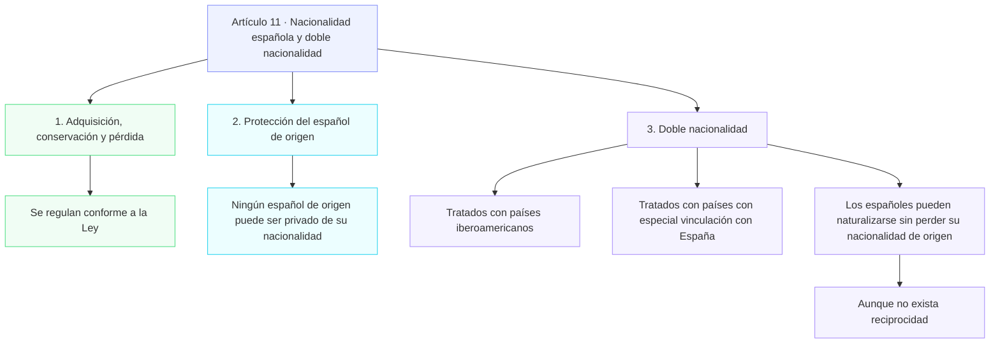
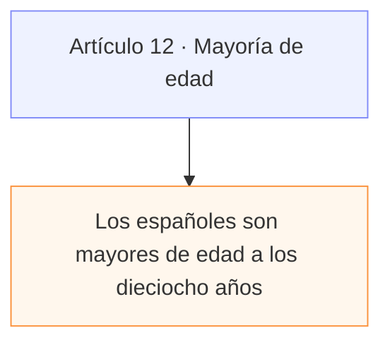
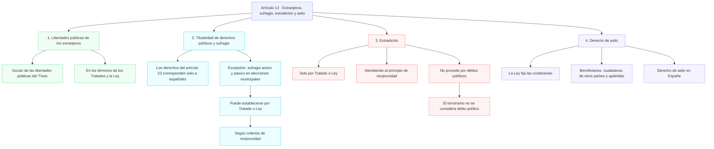

# Titulo I: De los derechos y deberes fundamentales

## Capitulo I: De los españoles y los extranjeros





```mermaid
```
```mermaid
```
```mermaid
```
```mermaid
```
```mermaid
```
```mermaid
```
```mermaid
```

