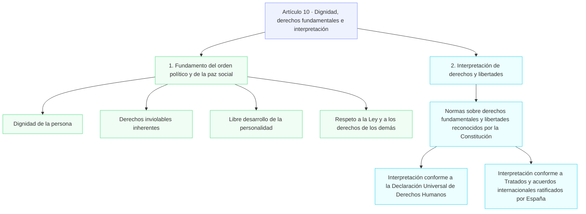

# Titulo I: De los derechos y deberes fundamentales

```mermaid
flowchart TD
    A10["Artículo 10 · Dignidad, derechos fundamentales e interpretación"]
    A10 --> A101["1. Fundamento del orden político y de la paz social"]
    A10 --> A102["2. Interpretación de derechos y libertades"]

    A101 --> A1011["Dignidad de la persona"]
    A101 --> A1012["Derechos inviolables inherentes"]
    A101 --> A1013["Libre desarrollo de la personalidad"]
    A101 --> A1014["Respeto a la Ley y a los derechos de los demás"]

    A102 --> A1021["Normas sobre derechos fundamentales y libertades reconocidos por la Constitución"]
    A1021 --> A1022["Interpretación conforme a la Declaración Universal de Derechos Humanos"]
    A1021 --> A1023["Interpretación conforme a Tratados y acuerdos internacionales ratificados por España"]

    classDef article fill:#eef2ff,stroke:#818cf8
    classDef foundation fill:#f0fdf4,stroke:#4ade80
    classDef interpretation fill:#ecfeff,stroke:#22d3ee
    class A10 article
    class A101,A1011,A1012,A1013,A1014 foundation
    class A102,A1021,A1022,A1023 interpretation
```

```mermaid
```
```mermaid
```

