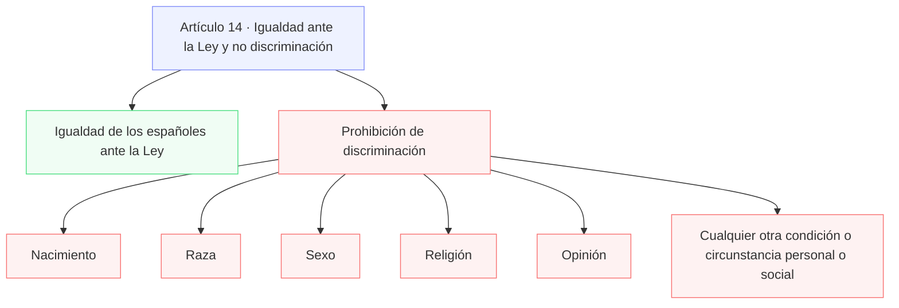

## Capítulo II: Derechos y Libertades   

```mermaid
flowchart TD
    A14["Artículo 14 · Igualdad ante la Ley y no discriminación"]
    A14 --> A141["Igualdad de los españoles ante la Ley"]
    A14 --> A142["Prohibición de discriminación"]

    A142 --> A1421["Nacimiento"]
    A142 --> A1422["Raza"]
    A142 --> A1423["Sexo"]
    A142 --> A1424["Religión"]
    A142 --> A1425["Opinión"]
    A142 --> A1426["Cualquier otra condición o circunstancia personal o social"]

    classDef article fill:#eef2ff,stroke:#818cf8
    classDef equality fill:#f0fdf4,stroke:#4ade80
    classDef nondiscrimination fill:#fef2f2,stroke:#f87171
    class A14 article
    class A141 equality
    class A142,A1421,A1422,A1423,A1424,A1425,A1426 nondiscrimination
```