### Sección I: De los derechos fundamentales y de las libertades públicas. 
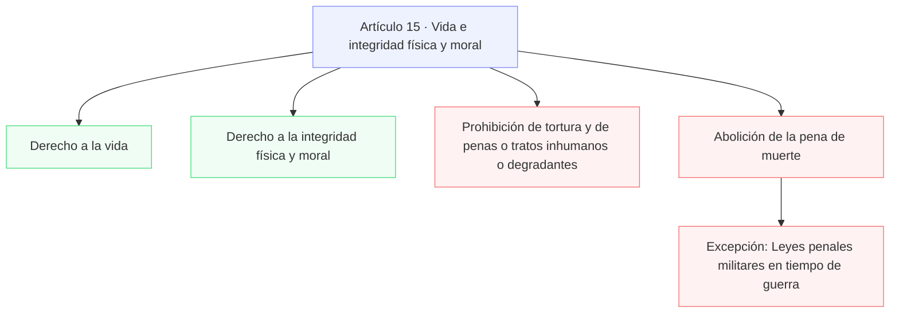
```mermaid
flowchart TD
    A15["Artículo 15 · Vida e integridad física y moral"]
    A15 --> A151["Derecho a la vida"]
    A15 --> A152["Derecho a la integridad física y moral"]
    A15 --> A153["Prohibición de tortura y de penas o tratos inhumanos o degradantes"]
    A15 --> A154["Abolición de la pena de muerte"]
    A154 --> A1541["Excepción: Leyes penales militares en tiempo de guerra"]

    classDef article fill:#eef2ff,stroke:#818cf8
    classDef right fill:#f0fdf4,stroke:#4ade80
    classDef protection fill:#fef2f2,stroke:#f87171
    class A15 article
    class A151,A152 right
    class A153,A154,A1541 protection
```
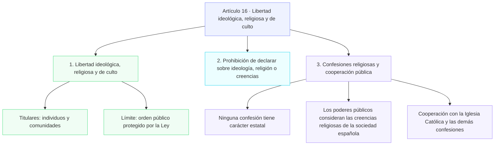
```mermaid
flowchart TD
    A16["Artículo 16 · Libertad ideológica, religiosa y de culto"]
    A16 --> A161["1. Libertad ideológica, religiosa y de culto"]
    A16 --> A162["2. Prohibición de declarar sobre ideología, religión o creencias"]
    A16 --> A163["3. Confesiones religiosas y cooperación pública"]

    A161 --> A1611["Titulares: individuos y comunidades"]
    A161 --> A1612["Límite: orden público protegido por la Ley"]
    A163 --> A1631["Ninguna confesión tiene carácter estatal"]
    A163 --> A1632["Los poderes públicos consideran las creencias religiosas de la sociedad española"]
    A163 --> A1633["Cooperación con la Iglesia Católica y las demás confesiones"]

    classDef article fill:#eef2ff,stroke:#818cf8
    classDef freedom fill:#f0fdf4,stroke:#4ade80
    classDef protection fill:#ecfeff,stroke:#22d3ee
    classDef cooperation fill:#f5f3ff,stroke:#a78bfa
    class A16 article
    class A161,A1611,A1612 freedom
    class A162 protection
    class A163,A1631,A1632,A1633 cooperation
```
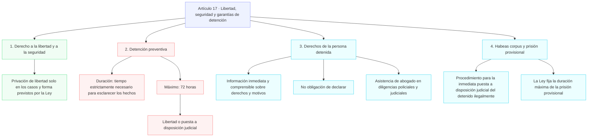
```mermaid
flowchart TD
    A17["Artículo 17 · Libertad, seguridad y garantías de detención"]
    A17 --> A171["1. Derecho a la libertad y a la seguridad"]
    A17 --> A172["2. Detención preventiva"]
    A17 --> A173["3. Derechos de la persona detenida"]
    A17 --> A174["4. Habeas corpus y prisión provisional"]

    A171 --> A1711["Privación de libertad solo en los casos y forma previstos por la Ley"]
    A172 --> A1721["Duración: tiempo estrictamente necesario para esclarecer los hechos"]
    A172 --> A1722["Máximo: 72 horas"]
    A1722 --> A1723["Libertad o puesta a disposición judicial"]
    A173 --> A1731["Información inmediata y comprensible sobre derechos y motivos"]
    A173 --> A1732["No obligación de declarar"]
    A173 --> A1733["Asistencia de abogado en diligencias policiales y judiciales"]
    A174 --> A1741["Procedimiento para la inmediata puesta a disposición judicial del detenido ilegalmente"]
    A174 --> A1742["La Ley fija la duración máxima de la prisión provisional"]

    classDef article fill:#eef2ff,stroke:#818cf8
    classDef right fill:#f0fdf4,stroke:#4ade80
    classDef detention fill:#fef2f2,stroke:#f87171
    classDef guarantee fill:#ecfeff,stroke:#22d3ee
    class A17 article
    class A171,A1711 right
    class A172,A1721,A1722,A1723 detention
    class A173,A1731,A1732,A1733,A174,A1741,A1742 guarantee
```
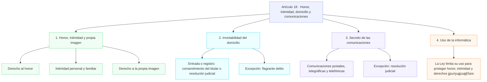
```mermaid
flowchart TD
    A18["Artículo 18 · Honor, intimidad, domicilio y comunicaciones"]
    A18 --> A181["1. Honor, intimidad y propia imagen"]
    A18 --> A182["2. Inviolabilidad del domicilio"]
    A18 --> A183["3. Secreto de las comunicaciones"]
    A18 --> A184["4. Uso de la informática"]

    A181 --> A1811["Derecho al honor"]
    A181 --> A1812["Intimidad personal y familiar"]
    A181 --> A1813["Derecho a la propia imagen"]
    A182 --> A1821["Entrada o registro: consentimiento del titular o resolución judicial"]
    A182 --> A1822["Excepción: flagrante delito"]
    A183 --> A1831["Comunicaciones postales, telegráficas y telefónicas"]
    A183 --> A1832["Excepción: resolución judicial"]
    A184 --> A1841["La Ley limita su uso para proteger honor, intimidad y derechos քաղաքացինos"]

    classDef article fill:#eef2ff,stroke:#818cf8
    classDef privacy fill:#f0fdf4,stroke:#4ade80
    classDef home fill:#ecfeff,stroke:#22d3ee
    classDef communication fill:#f5f3ff,stroke:#a78bfa
    classDef data fill:#fff7ed,stroke:#fb923c
    class A18 article
    class A181,A1811,A1812,A1813 privacy
    class A182,A1821,A1822 home
    class A183,A1831,A1832 communication
    class A184,A1841 data
```
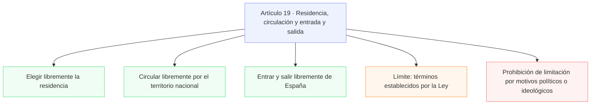
```mermaid
flowchart TD
    A19["Artículo 19 · Residencia, circulación y entrada y salida"]
    A19 --> A191["Elegir libremente la residencia"]
    A19 --> A192["Circular libremente por el territorio nacional"]
    A19 --> A193["Entrar y salir libremente de España"]
    A19 --> A194["Límite: términos establecidos por la Ley"]
    A19 --> A195["Prohibición de limitación por motivos políticos o ideológicos"]

    classDef article fill:#eef2ff,stroke:#818cf8
    classDef movement fill:#f0fdf4,stroke:#4ade80
    classDef limit fill:#fff7ed,stroke:#fb923c
    classDef protection fill:#fef2f2,stroke:#f87171
    class A19 article
    class A191,A192,A193 movement
    class A194 limit
    class A195 protection
```

```mermaid
flowchart TD
    A20["Artículo 20 · Libertades de expresión e información"]
    A20 --> A201["1. Derechos reconocidos y protegidos"]
    A20 --> A202["2. Prohibición de censura previa"]
    A20 --> A203["3. Medios de comunicación públicos"]
    A20 --> A204["4. Límites de las libertades"]
    A20 --> A205["5. Secuestro de publicaciones y medios"]

    A201 --> A201a["a) Expresar y difundir pensamientos, ideas y opiniones"]
    A201 --> A201b["b) Producción y creación literaria, artística, científica y técnica"]
    A201 --> A201c["c) Libertad de cátedra"]
    A201 --> A201d["d) Comunicar o recibir información veraz"]
    A201 --> A201e["Cláusula de conciencia y secreto profesional regulados por Ley"]
    A202 --> A2021["No se pueden restringir mediante censura previa"]
    A203 --> A2031["Organización y control parlamentario regulados por Ley"]
    A203 --> A2032["Acceso de grupos sociales y políticos significativos"]
    A203 --> A2033["Respeto al pluralismo social y lingüístico"]
    A204 --> A2041["Respeto a los derechos del Título y a sus Leyes de desarrollo"]
    A204 --> A2042["Honor, intimidad, propia imagen, juventud e infancia"]
    A205 --> A2051["Solo mediante resolución judicial"]

    classDef article fill:#eef2ff,stroke:#818cf8
    classDef freedoms fill:#f0fdf4,stroke:#4ade80
    classDef media fill:#ecfeff,stroke:#22d3ee
    classDef limits fill:#fef2f2,stroke:#f87171
    class A20 article
    class A201,A201a,A201b,A201c,A201d,A201e,A202,A2021 freedoms
    class A203,A2031,A2032,A2033 media
    class A204,A2041,A2042,A205,A2051 limits
```
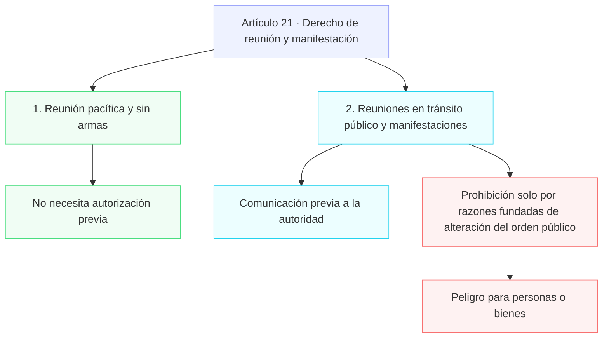
```mermaid
flowchart TD
    A21["Artículo 21 · Derecho de reunión y manifestación"]
    A21 --> A211["1. Reunión pacífica y sin armas"]
    A21 --> A212["2. Reuniones en tránsito público y manifestaciones"]

    A211 --> A2111["No necesita autorización previa"]
    A212 --> A2121["Comunicación previa a la autoridad"]
    A212 --> A2122["Prohibición solo por razones fundadas de alteración del orden público"]
    A2122 --> A2123["Peligro para personas o bienes"]

    classDef article fill:#eef2ff,stroke:#818cf8
    classDef right fill:#f0fdf4,stroke:#4ade80
    classDef procedure fill:#ecfeff,stroke:#22d3ee
    classDef limit fill:#fef2f2,stroke:#f87171
    class A21 article
    class A211,A2111 right
    class A212,A2121 procedure
    class A2122,A2123 limit
```
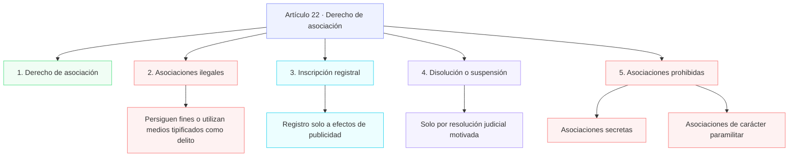
```mermaid
flowchart TD
    A22["Artículo 22 · Derecho de asociación"]
    A22 --> A221["1. Derecho de asociación"]
    A22 --> A222["2. Asociaciones ilegales"]
    A22 --> A223["3. Inscripción registral"]
    A22 --> A224["4. Disolución o suspensión"]
    A22 --> A225["5. Asociaciones prohibidas"]

    A222 --> A2221["Persiguen fines o utilizan medios tipificados como delito"]
    A223 --> A2231["Registro solo a efectos de publicidad"]
    A224 --> A2241["Solo por resolución judicial motivada"]
    A225 --> A2251["Asociaciones secretas"]
    A225 --> A2252["Asociaciones de carácter paramilitar"]

    classDef article fill:#eef2ff,stroke:#818cf8
    classDef right fill:#f0fdf4,stroke:#4ade80
    classDef obligation fill:#ecfeff,stroke:#22d3ee
    classDef judicial fill:#f5f3ff,stroke:#a78bfa
    classDef prohibited fill:#fef2f2,stroke:#f87171
    class A22 article
    class A221 right
    class A223,A2231 obligation
    class A224,A2241 judicial
    class A222,A2221,A225,A2251,A2252 prohibited
```
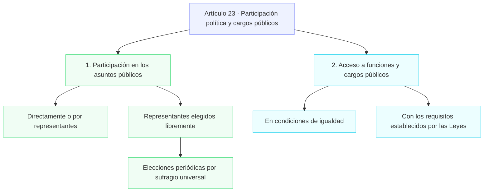
```mermaid
flowchart TD
    A23["Artículo 23 · Participación política y cargos públicos"]
    A23 --> A231["1. Participación en los asuntos públicos"]
    A23 --> A232["2. Acceso a funciones y cargos públicos"]

    A231 --> A2311["Directamente o por representantes"]
    A231 --> A2312["Representantes elegidos libremente"]
    A2312 --> A2313["Elecciones periódicas por sufragio universal"]
    A232 --> A2321["En condiciones de igualdad"]
    A232 --> A2322["Con los requisitos establecidos por las Leyes"]

    classDef article fill:#eef2ff,stroke:#818cf8
    classDef participation fill:#f0fdf4,stroke:#4ade80
    classDef equality fill:#ecfeff,stroke:#22d3ee
    class A23 article
    class A231,A2311,A2312,A2313 participation
    class A232,A2321,A2322 equality
```
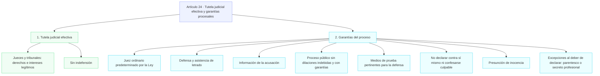
```mermaid
flowchart TD
    A24["Artículo 24 · Tutela judicial efectiva y garantías procesales"]
    A24 --> A241["1. Tutela judicial efectiva"]
    A24 --> A242["2. Garantías del proceso"]

    A241 --> A2411["Jueces y tribunales: derechos e intereses legítimos"]
    A241 --> A2412["Sin indefensión"]
    A242 --> A2421["Juez ordinario predeterminado por la Ley"]
    A242 --> A2422["Defensa y asistencia de letrado"]
    A242 --> A2423["Información de la acusación"]
    A242 --> A2424["Proceso público sin dilaciones indebidas y con garantías"]
    A242 --> A2425["Medios de prueba pertinentes para la defensa"]
    A242 --> A2426["No declarar contra sí mismo ni confesarse culpable"]
    A242 --> A2427["Presunción de inocencia"]
    A242 --> A2428["Excepciones al deber de declarar: parentesco o secreto profesional"]

    classDef article fill:#eef2ff,stroke:#818cf8
    classDef protection fill:#f0fdf4,stroke:#4ade80
    classDef guarantee fill:#ecfeff,stroke:#22d3ee
    class A24 article
    class A241,A2411,A2412 protection
    class A242,A2421,A2422,A2423,A2424,A2425,A2426,A2427,A2428 guarantee
```
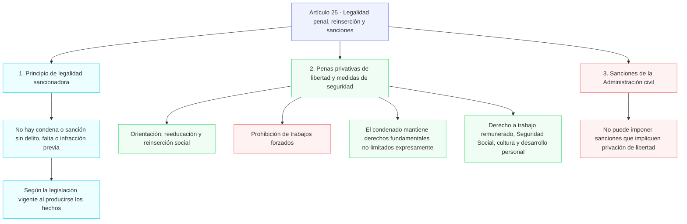
```mermaid
flowchart TD
    A25["Artículo 25 · Legalidad penal, reinserción y sanciones"]
    A25 --> A251["1. Principio de legalidad sancionadora"]
    A25 --> A252["2. Penas privativas de libertad y medidas de seguridad"]
    A25 --> A253["3. Sanciones de la Administración civil"]

    A251 --> A2511["No hay condena o sanción sin delito, falta o infracción previa"]
    A2511 --> A2512["Según la legislación vigente al producirse los hechos"]
    A252 --> A2521["Orientación: reeducación y reinserción social"]
    A252 --> A2522["Prohibición de trabajos forzados"]
    A252 --> A2523["El condenado mantiene derechos fundamentales no limitados expresamente"]
    A252 --> A2524["Derecho a trabajo remunerado, Seguridad Social, cultura y desarrollo personal"]
    A253 --> A2531["No puede imponer sanciones que impliquen privación de libertad"]

    classDef article fill:#eef2ff,stroke:#818cf8
    classDef legality fill:#ecfeff,stroke:#22d3ee
    classDef reintegration fill:#f0fdf4,stroke:#4ade80
    classDef prohibition fill:#fef2f2,stroke:#f87171
    class A25 article
    class A251,A2511,A2512 legality
    class A252,A2521,A2523,A2524 reintegration
    class A2522,A253,A2531 prohibition
```
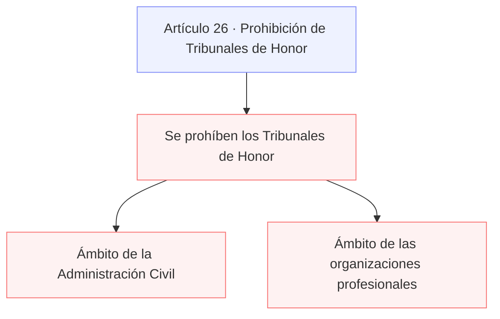
```mermaid
flowchart TD
    A26["Artículo 26 · Prohibición de Tribunales de Honor"]
    A26 --> A261["Se prohíben los Tribunales de Honor"]
    A261 --> A2611["Ámbito de la Administración Civil"]
    A261 --> A2612["Ámbito de las organizaciones profesionales"]

    classDef article fill:#eef2ff,stroke:#818cf8
    classDef prohibition fill:#fef2f2,stroke:#f87171
    class A26 article
    class A261,A2611,A2612 prohibition
```

```mermaid
flowchart TD
    A27["Artículo 27 · Derecho a la educación y sistema educativo"]
    A27 --> A271["1. Derecho a la educación y libertad de enseñanza"]
    A27 --> A272["2. Finalidad de la educación"]
    A27 --> A273["3. Formación religiosa y moral ըստ convicciones de los padres"]
    A27 --> A274["4. Enseñanza básica obligatoria y gratuita"]
    A27 --> A275["5. Garantía pública del derecho a la educación"]
    A27 --> A276["6. Libertad de creación de centros docentes"]
    A27 --> A277["7. Participación en control y gestión de centros públicos"]
    A27 --> A278["8. Inspección y homologación del sistema educativo"]
    A27 --> A279["9. Ayuda pública a centros que cumplan los requisitos legales"]
    A27 --> A2710["10. Autonomía de las Universidades"]

    A272 --> A2721["Pleno desarrollo de la personalidad humana"]
    A272 --> A2722["Respeto a principios democráticos, derechos y libertades fundamentales"]
    A273 --> A2731["Los poderes públicos garantizan este derecho"]
    A275 --> A2751["Programación general de la enseñanza"]
    A275 --> A2752["Participación efectiva de los sectores afectados"]
    A275 --> A2753["Creación de centros docentes"]
    A276 --> A2761["Personas físicas y jurídicas"]
    A276 --> A2762["Respeto a los principios constitucionales"]
    A277 --> A2771["Profesores, padres y, en su caso, alumnos"]
    A277 --> A2772["Centros sostenidos con fondos públicos"]
    A278 --> A2781["Garantizar el cumplimiento de las Leyes"]
    A2710 --> A27101["En los términos que establezca la Ley"]

    classDef article fill:#eef2ff,stroke:#818cf8
    classDef right fill:#f0fdf4,stroke:#4ade80
    classDef public fill:#ecfeff,stroke:#22d3ee
    classDef education fill:#f5f3ff,stroke:#a78bfa
    class A27 article
    class A271,A272,A274,A276,A2710 right
    class A273,A275,A277,A278,A279 public
    class A2721,A2722,A2731,A2751,A2752,A2753,A2761,A2762,A2771,A2772,A2781,A27101 education
```
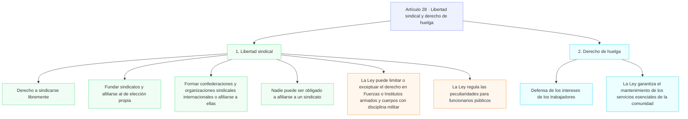
```mermaid
flowchart TD
    A28["Artículo 28 · Libertad sindical y derecho de huelga"]
    A28 --> A281["1. Libertad sindical"]
    A28 --> A282["2. Derecho de huelga"]

    A281 --> A2811["Derecho a sindicarse libremente"]
    A281 --> A2812["Fundar sindicatos y afiliarse al de elección propia"]
    A281 --> A2813["Formar confederaciones y organizaciones sindicales internacionales o afiliarse a ellas"]
    A281 --> A2814["Nadie puede ser obligado a afiliarse a un sindicato"]
    A281 --> A2815["La Ley puede limitar o exceptuar el derecho en Fuerzas o Institutos armados y cuerpos con disciplina militar"]
    A281 --> A2816["La Ley regula las peculiaridades para funcionarios públicos"]
    A282 --> A2821["Defensa de los intereses de los trabajadores"]
    A282 --> A2822["La Ley garantiza el mantenimiento de los servicios esenciales de la comunidad"]

    classDef article fill:#eef2ff,stroke:#818cf8
    classDef union fill:#f0fdf4,stroke:#4ade80
    classDef strike fill:#ecfeff,stroke:#22d3ee
    classDef limit fill:#fff7ed,stroke:#fb923c
    class A28 article
    class A281,A2811,A2812,A2813,A2814 union
    class A282,A2821,A2822 strike
    class A2815,A2816 limit
```
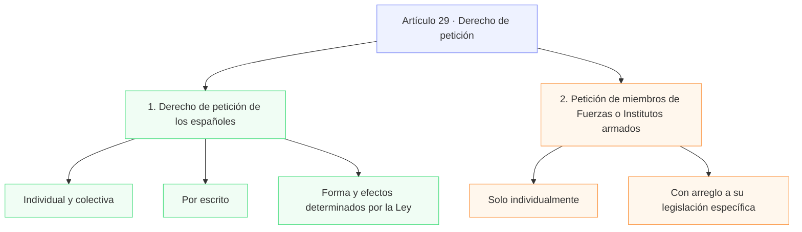
```mermaid
flowchart TD
    A29["Artículo 29 · Derecho de petición"]
    A29 --> A291["1. Derecho de petición de los españoles"]
    A29 --> A292["2. Petición de miembros de Fuerzas o Institutos armados"]

    A291 --> A2911["Individual y colectiva"]
    A291 --> A2912["Por escrito"]
    A291 --> A2913["Forma y efectos determinados por la Ley"]
    A292 --> A2921["Solo individualmente"]
    A292 --> A2922["Con arreglo a su legislación específica"]

    classDef article fill:#eef2ff,stroke:#818cf8
    classDef right fill:#f0fdf4,stroke:#4ade80
    classDef military fill:#fff7ed,stroke:#fb923c
    class A29 article
    class A291,A2911,A2912,A2913 right
    class A292,A2921,A2922 military
```