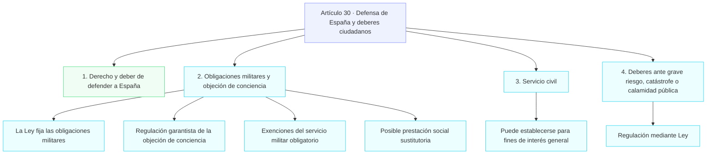
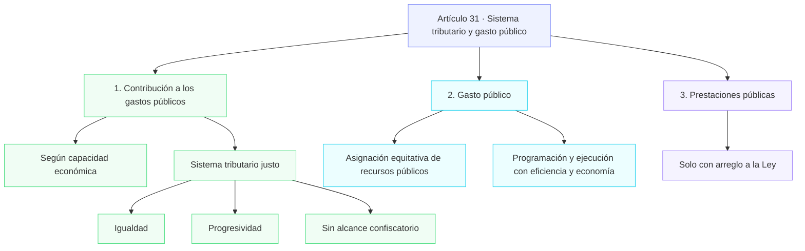
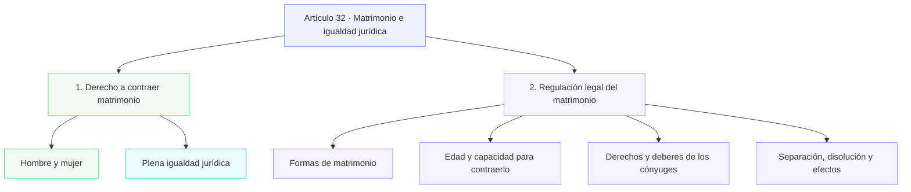
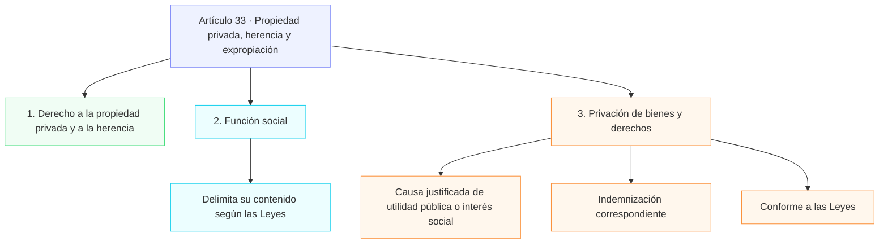
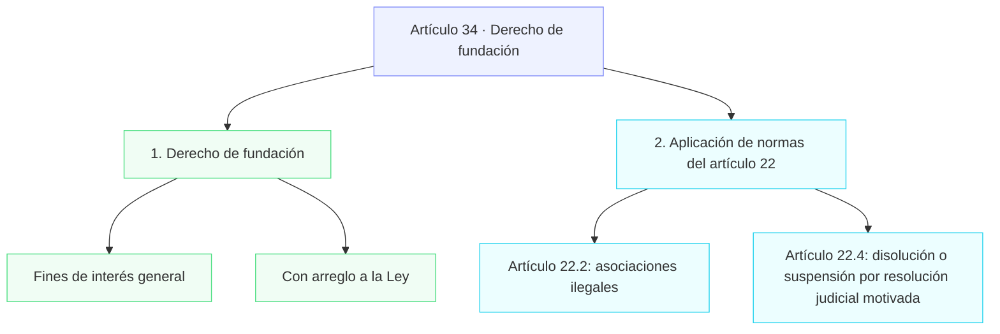
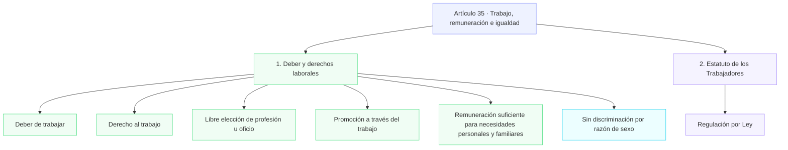
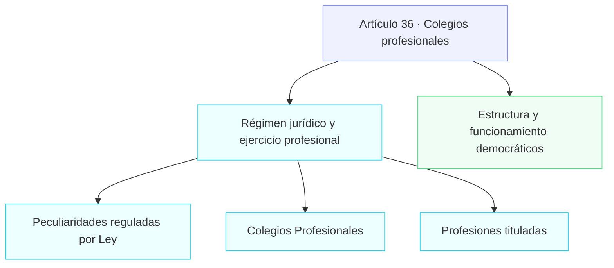
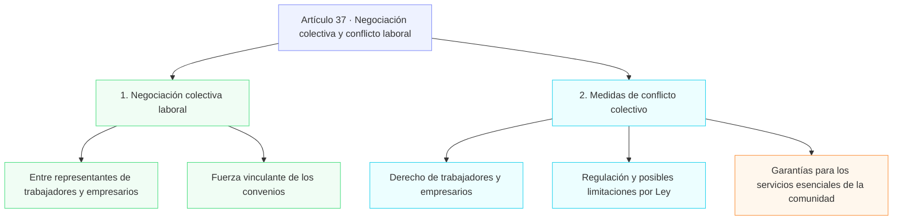
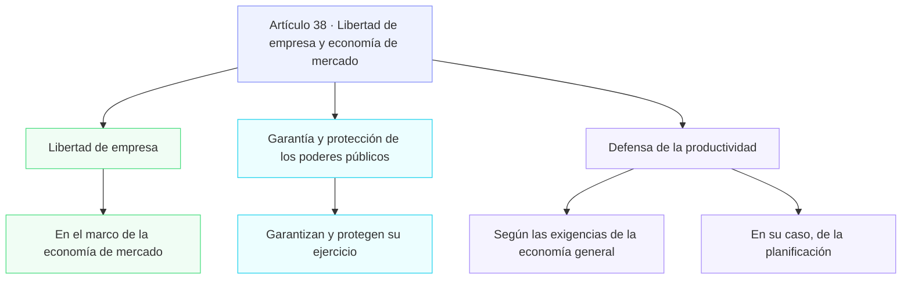

### Sección II: De los derechos y deberes de los ciudadanos

```mermaid
flowchart TD
    A30["Artículo 30 · Defensa de España y deberes ciudadanos"]
    A30 --> A301["1. Derecho y deber de defender a España"]
    A30 --> A302["2. Obligaciones militares y objeción de conciencia"]
    A30 --> A303["3. Servicio civil"]
    A30 --> A304["4. Deberes ante grave riesgo, catástrofe o calamidad pública"]

    A302 --> A3021["La Ley fija las obligaciones militares"]
    A302 --> A3022["Regulación garantista de la objeción de conciencia"]
    A302 --> A3023["Exenciones del servicio militar obligatorio"]
    A302 --> A3024["Posible prestación social sustitutoria"]
    A303 --> A3031["Puede establecerse para fines de interés general"]
    A304 --> A3041["Regulación mediante Ley"]

    classDef article fill:#eef2ff,stroke:#818cf8
    classDef duty fill:#f0fdf4,stroke:#4ade80
    classDef law fill:#ecfeff,stroke:#22d3ee
    class A30 article
    class A301 duty
    class A302,A3021,A3022,A3023,A3024,A303,A3031,A304,A3041 law
```

```mermaid
flowchart TD
    A31["Artículo 31 · Sistema tributario y gasto público"]
    A31 --> A311["1. Contribución a los gastos públicos"]
    A31 --> A312["2. Gasto público"]
    A31 --> A313["3. Prestaciones públicas"]

    A311 --> A3111["Según capacidad económica"]
    A311 --> A3112["Sistema tributario justo"]
    A3112 --> A3113["Igualdad"]
    A3112 --> A3114["Progresividad"]
    A3112 --> A3115["Sin alcance confiscatorio"]
    A312 --> A3121["Asignación equitativa de recursos públicos"]
    A312 --> A3122["Programación y ejecución con eficiencia y economía"]
    A313 --> A3131["Solo con arreglo a la Ley"]

    classDef article fill:#eef2ff,stroke:#818cf8
    classDef tax fill:#f0fdf4,stroke:#4ade80
    classDef public fill:#ecfeff,stroke:#22d3ee
    classDef law fill:#f5f3ff,stroke:#a78bfa
    class A31 article
    class A311,A3111,A3112,A3113,A3114,A3115 tax
    class A312,A3121,A3122 public
    class A313,A3131 law
```

```mermaid
flowchart TD
    A32["Artículo 32 · Matrimonio e igualdad jurídica"]
    A32 --> A321["1. Derecho a contraer matrimonio"]
    A32 --> A322["2. Regulación legal del matrimonio"]

    A321 --> A3211["Hombre y mujer"]
    A321 --> A3212["Plena igualdad jurídica"]
    A322 --> A3221["Formas de matrimonio"]
    A322 --> A3222["Edad y capacidad para contraerlo"]
    A322 --> A3223["Derechos y deberes de los cónyuges"]
    A322 --> A3224["Separación, disolución y efectos"]

    classDef article fill:#eef2ff,stroke:#818cf8
    classDef right fill:#f0fdf4,stroke:#4ade80
    classDef equality fill:#ecfeff,stroke:#22d3ee
    classDef law fill:#f5f3ff,stroke:#a78bfa
    class A32 article
    class A321,A3211 right
    class A3212 equality
    class A322,A3221,A3222,A3223,A3224 law
```

```mermaid
flowchart TD
    A33["Artículo 33 · Propiedad privada, herencia y expropiación"]
    A33 --> A331["1. Derecho a la propiedad privada y a la herencia"]
    A33 --> A332["2. Función social"]
    A33 --> A333["3. Privación de bienes y derechos"]

    A332 --> A3321["Delimita su contenido según las Leyes"]
    A333 --> A3331["Causa justificada de utilidad pública o interés social"]
    A333 --> A3332["Indemnización correspondiente"]
    A333 --> A3333["Conforme a las Leyes"]

    classDef article fill:#eef2ff,stroke:#818cf8
    classDef right fill:#f0fdf4,stroke:#4ade80
    classDef social fill:#ecfeff,stroke:#22d3ee
    classDef guarantee fill:#fff7ed,stroke:#fb923c
    class A33 article
    class A331 right
    class A332,A3321 social
    class A333,A3331,A3332,A3333 guarantee
```

```mermaid
flowchart TD
    A34["Artículo 34 · Derecho de fundación"]
    A34 --> A341["1. Derecho de fundación"]
    A34 --> A342["2. Aplicación de normas del artículo 22"]

    A341 --> A3411["Fines de interés general"]
    A341 --> A3412["Con arreglo a la Ley"]
    A342 --> A3421["Artículo 22.2: asociaciones ilegales"]
    A342 --> A3422["Artículo 22.4: disolución o suspensión por resolución judicial motivada"]

    classDef article fill:#eef2ff,stroke:#818cf8
    classDef right fill:#f0fdf4,stroke:#4ade80
    classDef reference fill:#ecfeff,stroke:#22d3ee
    class A34 article
    class A341,A3411,A3412 right
    class A342,A3421,A3422 reference
```

```mermaid
flowchart TD
    A35["Artículo 35 · Trabajo, remuneración e igualdad"]
    A35 --> A351["1. Deber y derechos laborales"]
    A35 --> A352["2. Estatuto de los Trabajadores"]

    A351 --> A3511["Deber de trabajar"]
    A351 --> A3512["Derecho al trabajo"]
    A351 --> A3513["Libre elección de profesión u oficio"]
    A351 --> A3514["Promoción a través del trabajo"]
    A351 --> A3515["Remuneración suficiente para necesidades personales y familiares"]
    A351 --> A3516["Sin discriminación por razón de sexo"]
    A352 --> A3521["Regulación por Ley"]

    classDef article fill:#eef2ff,stroke:#818cf8
    classDef work fill:#f0fdf4,stroke:#4ade80
    classDef equality fill:#ecfeff,stroke:#22d3ee
    classDef law fill:#f5f3ff,stroke:#a78bfa
    class A35 article
    class A351,A3511,A3512,A3513,A3514,A3515 work
    class A3516 equality
    class A352,A3521 law
```

```mermaid
flowchart TD
    A36["Artículo 36 · Colegios profesionales"]
    A36 --> A361["Régimen jurídico y ejercicio profesional"]
    A36 --> A362["Estructura y funcionamiento democráticos"]

    A361 --> A3611["Peculiaridades reguladas por Ley"]
    A361 --> A3612["Colegios Profesionales"]
    A361 --> A3613["Profesiones tituladas"]

    classDef article fill:#eef2ff,stroke:#818cf8
    classDef law fill:#ecfeff,stroke:#22d3ee
    classDef democracy fill:#f0fdf4,stroke:#4ade80
    class A36 article
    class A361,A3611,A3612,A3613 law
    class A362 democracy
```

```mermaid
flowchart TD
    A37["Artículo 37 · Negociación colectiva y conflicto laboral"]
    A37 --> A371["1. Negociación colectiva laboral"]
    A37 --> A372["2. Medidas de conflicto colectivo"]

    A371 --> A3711["Entre representantes de trabajadores y empresarios"]
    A371 --> A3712["Fuerza vinculante de los convenios"]
    A372 --> A3721["Derecho de trabajadores y empresarios"]
    A372 --> A3722["Regulación y posibles limitaciones por Ley"]
    A372 --> A3723["Garantías para los servicios esenciales de la comunidad"]

    classDef article fill:#eef2ff,stroke:#818cf8
    classDef agreement fill:#f0fdf4,stroke:#4ade80
    classDef conflict fill:#ecfeff,stroke:#22d3ee
    classDef guarantee fill:#fff7ed,stroke:#fb923c
    class A37 article
    class A371,A3711,A3712 agreement
    class A372,A3721,A3722 conflict
    class A3723 guarantee
```

```mermaid
flowchart TD
    A38["Artículo 38 · Libertad de empresa y economía de mercado"]
    A38 --> A381["Libertad de empresa"]
    A38 --> A382["Garantía y protección de los poderes públicos"]
    A38 --> A383["Defensa de la productividad"]

    A381 --> A3811["En el marco de la economía de mercado"]
    A382 --> A3821["Garantizan y protegen su ejercicio"]
    A383 --> A3831["Según las exigencias de la economía general"]
    A383 --> A3832["En su caso, de la planificación"]

    classDef article fill:#eef2ff,stroke:#818cf8
    classDef business fill:#f0fdf4,stroke:#4ade80
    classDef public fill:#ecfeff,stroke:#22d3ee
    classDef economy fill:#f5f3ff,stroke:#a78bfa
    class A38 article
    class A381,A3811 business
    class A382,A3821 public
    class A383,A3831,A3832 economy
```