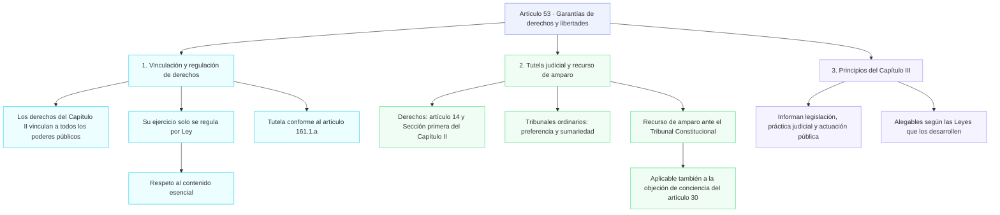
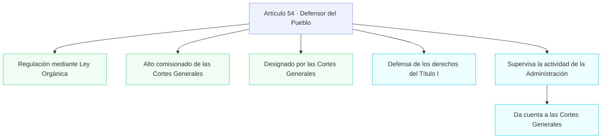
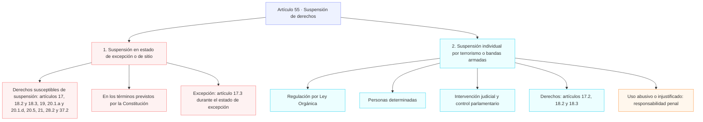
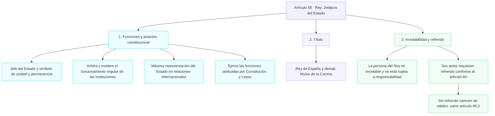
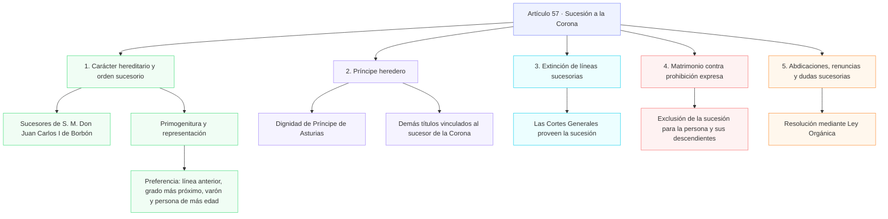
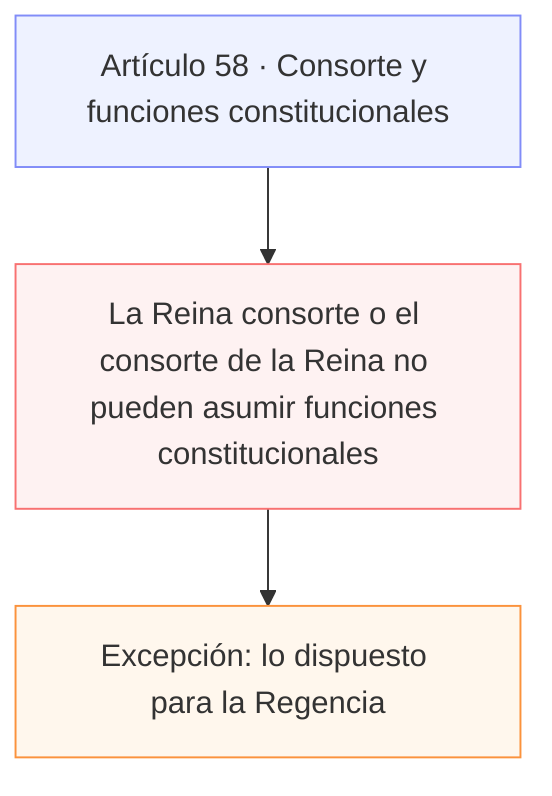
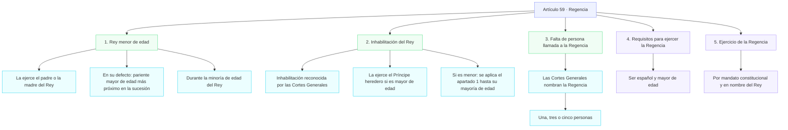
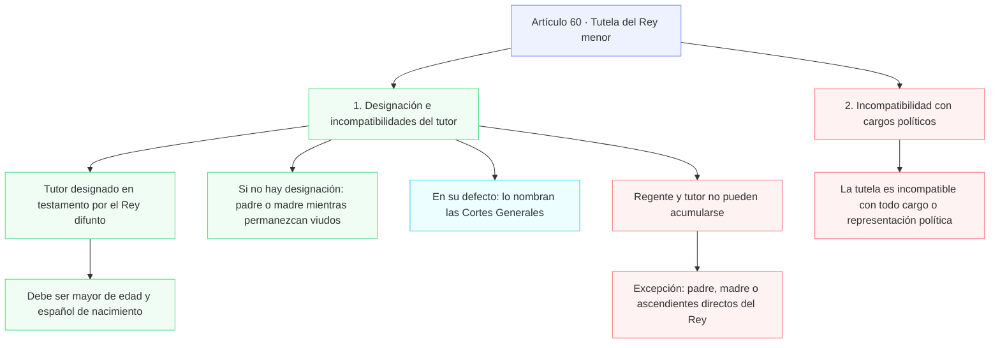
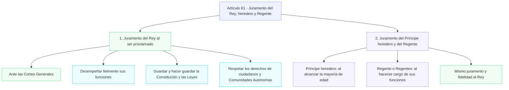

## Capítulo IV: De las garantias de las liebertades y derechos fundamentales

```mermaid
flowchart TD
    A62["Artículo 62 · Funciones del Rey"]
    A62 --> A62a["a) Sancionar y promulgar las Leyes"]
    A62 --> A62b["b) Convocar y disolver las Cortes Generales; convocar elecciones"]
    A62 --> A62c["c) Convocar referéndum en los casos previstos"]
    A62 --> A62d["d) Proponer y, en su caso, nombrar al Presidente del Gobierno; poner fin a sus funciones"]
    A62 --> A62e["e) Nombrar y separar a los miembros del Gobierno, a propuesta de su Presidente"]
    A62 --> A62f["f) Expedir decretos, conferir empleos y conceder honores y distinciones"]
    A62 --> A62g["g) Ser informado de asuntos de Estado y presidir el Consejo de Ministros cuando proceda"]
    A62 --> A62h["h) Mando supremo de las Fuerzas Armadas"]
    A62 --> A62i["i) Ejercer el derecho de gracia conforme a la Ley"]
    A62 --> A62j["j) Alto Patronazgo de las Reales Academias"]

    A62b --> A62b1["En los términos previstos en la Constitución"]
    A62f --> A62f1["Con arreglo a las Leyes"]
    A62g --> A62g1["A petición del Presidente del Gobierno"]
    A62i --> A62i1["No se autorizan indultos generales"]

    classDef article fill:#eef2ff,stroke:#818cf8
    classDef legislative fill:#f0fdf4,stroke:#4ade80
    classDef government fill:#ecfeff,stroke:#22d3ee
    classDef state fill:#f5f3ff,stroke:#a78bfa
    classDef military fill:#fff7ed,stroke:#fb923c
    classDef limit fill:#fef2f2,stroke:#f87171
    class A62 article
    class A62a,A62b,A62b1,A62c legislative
    class A62d,A62e,A62g,A62g1 government
    class A62f,A62f1,A62j state
    class A62h military
    class A62i,A62i1 limit
```










```mermaid
```
```mermaid
```
```mermaid
```
```mermaid
```
```mermaid
```
```mermaid
```
```mermaid
```
```mermaid
```
```mermaid
```
```mermaid
```
```mermaid
```
