# TITULO I: DEL PODER GALLEGO

```mermaid
---
config:
  theme: base
  themeVariables:
    primaryColor: '#eef2ff'
    primaryBorderColor: '#818cf8'
    primaryTextColor: '#312e81'
    lineColor: '#818cf8'
---
flowchart LR
    H["<b>ARTÍCULO 9<br/>Poderes autonómicos</b>"]
    H --> A["<b>(1) Instituciones</b>"]
    A --> A1["Parlamento · Junta · Presidente"]
    H --> B["<b>(2) Funcionamiento</b>"]
    B --> B1["Regulado por leyes de Galicia<br/>Conforme a Constitución y Estatuto"]
```
## CAP I: DEL PARLAMENTO
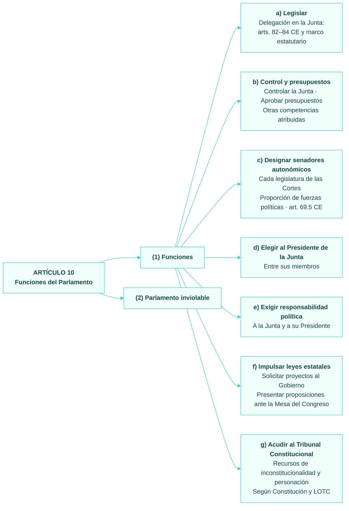
```mermaid
---
config:
  theme: base
  themeVariables:
    primaryColor: '#f0fdfa'
    primaryBorderColor: '#2dd4bf'
    primaryTextColor: '#134e4a'
    lineColor: '#2dd4bf'
---
flowchart LR
    H["<b>ARTÍCULO 10<br/>Funciones del Parlamento</b>"]
    H --> A["<b>(1) Funciones</b>"]
    A --> A1["<b>a) Legislar</b><br/>Delegación en la Junta:<br/>arts. 82–84 CE y marco estatutario"]
    A --> A2["<b>b) Control y presupuestos</b><br/>Controlar la Junta · Aprobar presupuestos<br/>Otras competencias atribuidas"]
    A --> A3["<b>c) Designar senadores autonómicos</b><br/>Cada legislatura de las Cortes<br/>Proporción de fuerzas políticas · art. 69.5 CE"]
    A --> A4["<b>d) Elegir al Presidente de la Junta</b><br/>Entre sus miembros"]
    A --> A5["<b>e) Exigir responsabilidad política</b><br/>A la Junta y a su Presidente"]
    A --> A6["<b>f) Impulsar leyes estatales</b><br/>Solicitar proyectos al Gobierno<br/>Presentar proposiciones ante la Mesa del Congreso"]
    A --> A7["<b>g) Acudir al Tribunal Constitucional</b><br/>Recursos de inconstitucionalidad y personación<br/>Según Constitución y LOTC"]
    H --> B["<b>(2) Parlamento inviolable</b>"]
```
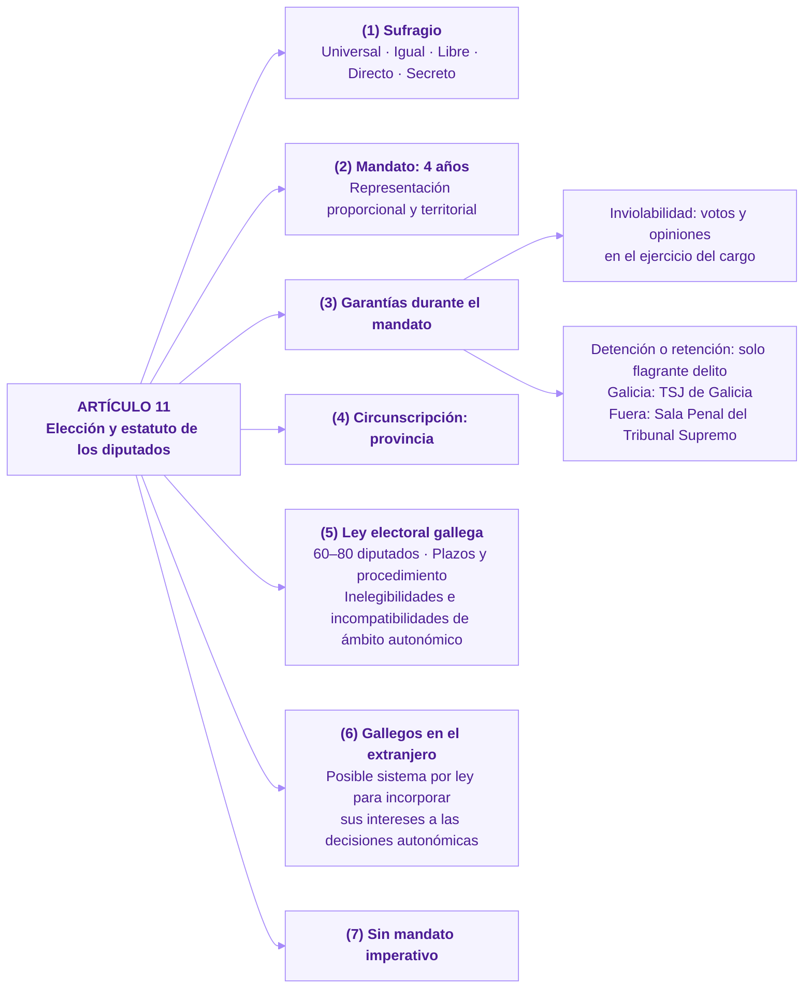
```mermaid
---
config:
  theme: base
  themeVariables:
    primaryColor: '#f5f3ff'
    primaryBorderColor: '#a78bfa'
    primaryTextColor: '#4c1d95'
    lineColor: '#a78bfa'
---
flowchart LR
    H["<b>ARTÍCULO 11<br/>Elección y estatuto de los diputados</b>"]
    H --> A["<b>(1) Sufragio</b><br/>Universal · Igual · Libre · Directo · Secreto"]
    H --> B["<b>(2) Mandato: 4 años</b><br/>Representación proporcional y territorial"]
    H --> C["<b>(3) Garantías durante el mandato</b>"]
    C --> C1["Inviolabilidad: votos y opiniones<br/>en el ejercicio del cargo"]
    C --> C2["Detención o retención: solo flagrante delito<br/>Galicia: TSJ de Galicia<br/>Fuera: Sala Penal del Tribunal Supremo"]
    H --> D["<b>(4) Circunscripción: provincia</b>"]
    H --> E["<b>(5) Ley electoral gallega</b><br/>60–80 diputados · Plazos y procedimiento<br/>Inelegibilidades e incompatibilidades de ámbito autonómico"]
    H --> F["<b>(6) Gallegos en el extranjero</b><br/>Posible sistema por ley para incorporar<br/>sus intereses a las decisiones autonómicas"]
    H --> G["<b>(7) Sin mandato imperativo</b>"]
```
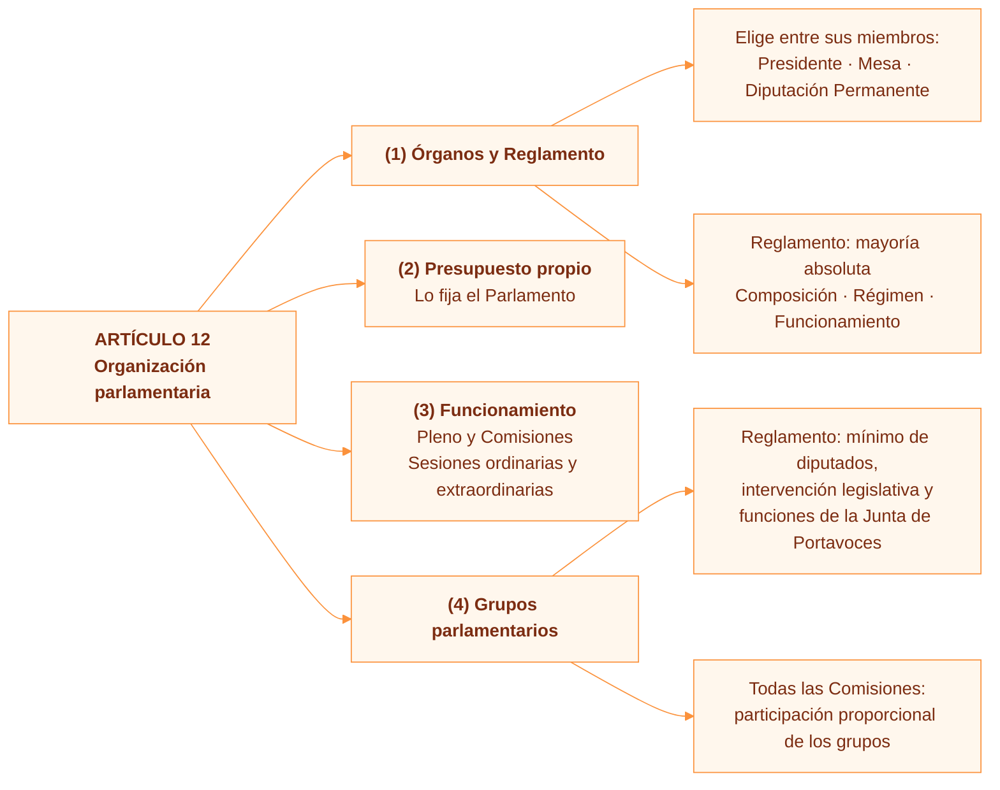
```mermaid
---
config:
  theme: base
  themeVariables:
    primaryColor: '#fff7ed'
    primaryBorderColor: '#fb923c'
    primaryTextColor: '#7c2d12'
    lineColor: '#fb923c'
---
flowchart LR
    H["<b>ARTÍCULO 12<br/>Organización parlamentaria</b>"]
    H --> A["<b>(1) Órganos y Reglamento</b>"]
    A --> A1["Elige entre sus miembros:<br/>Presidente · Mesa · Diputación Permanente"]
    A --> A2["Reglamento: mayoría absoluta<br/>Composición · Régimen · Funcionamiento"]
    H --> B["<b>(2) Presupuesto propio</b><br/>Lo fija el Parlamento"]
    H --> C["<b>(3) Funcionamiento</b><br/>Pleno y Comisiones<br/>Sesiones ordinarias y extraordinarias"]
    H --> D["<b>(4) Grupos parlamentarios</b>"]
    D --> D1["Reglamento: mínimo de diputados,<br/>intervención legislativa y<br/>funciones de la Junta de Portavoces"]
    D --> D2["Todas las Comisiones:<br/>participación proporcional de los grupos"]
```
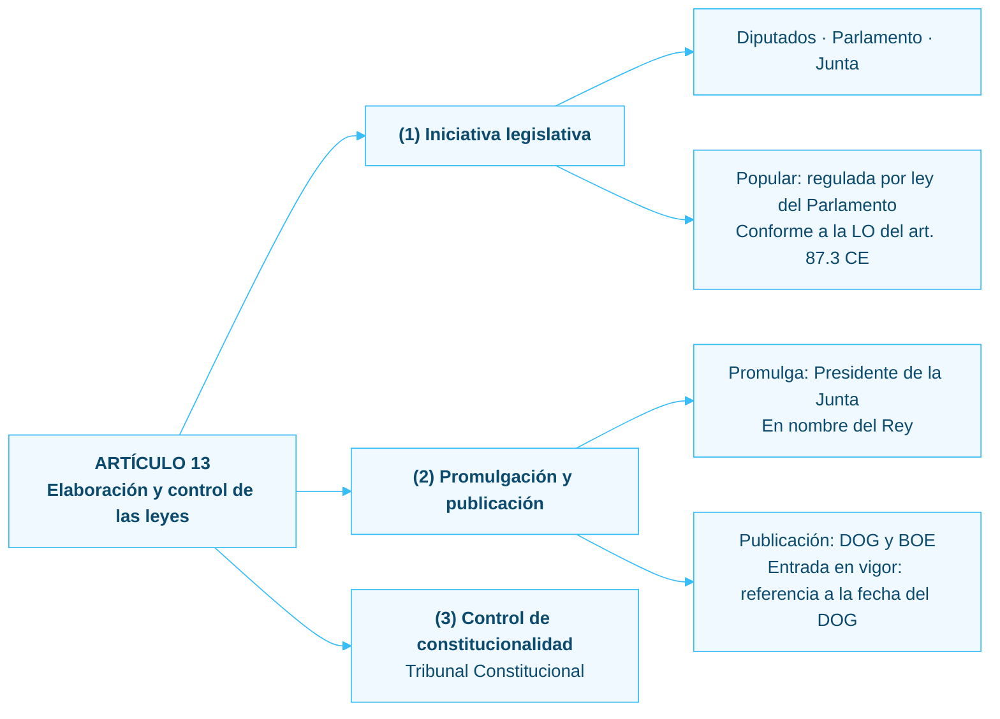
```mermaid
---
config:
  theme: base
  themeVariables:
    primaryColor: '#f0f9ff'
    primaryBorderColor: '#38bdf8'
    primaryTextColor: '#0c4a6e'
    lineColor: '#38bdf8'
---
flowchart LR
    H["<b>ARTÍCULO 13<br/>Elaboración y control de las leyes</b>"]
    H --> A["<b>(1) Iniciativa legislativa</b>"]
    A --> A1["Diputados · Parlamento · Junta"]
    A --> A2["Popular: regulada por ley del Parlamento<br/>Conforme a la LO del art. 87.3 CE"]
    H --> B["<b>(2) Promulgación y publicación</b>"]
    B --> B1["Promulga: Presidente de la Junta<br/>En nombre del Rey"]
    B --> B2["Publicación: DOG y BOE<br/>Entrada en vigor: referencia a la fecha del DOG"]
    H --> C["<b>(3) Control de constitucionalidad</b><br/>Tribunal Constitucional"]
```
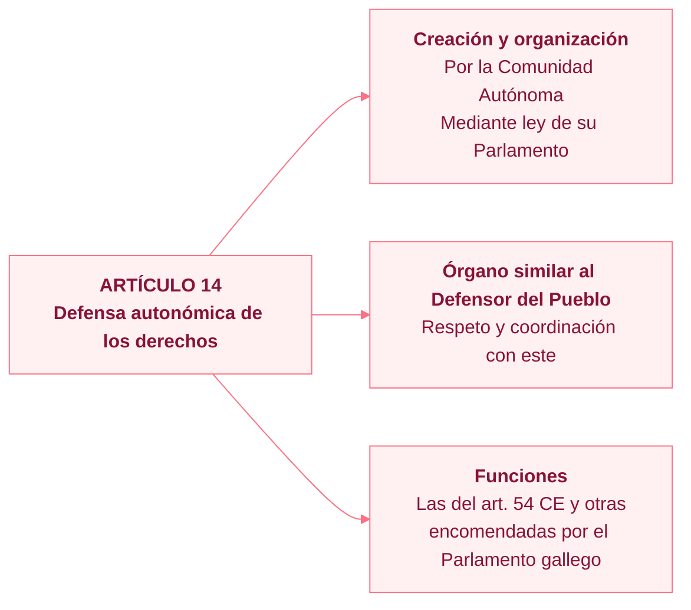
```mermaid
---
config:
  theme: base
  themeVariables:
    primaryColor: '#fff1f2'
    primaryBorderColor: '#fb7185'
    primaryTextColor: '#881337'
    lineColor: '#fb7185'
---
flowchart LR
    H["<b>ARTÍCULO 14<br/>Defensa autonómica de los derechos</b>"]
    H --> A["<b>Creación y organización</b><br/>Por la Comunidad Autónoma<br/>Mediante ley de su Parlamento"]
    H --> B["<b>Órgano similar al Defensor del Pueblo</b><br/>Respeto y coordinación con este"]
    H --> C["<b>Funciones</b><br/>Las del art. 54 CE y otras<br/>encomendadas por el Parlamento gallego"]
```
## CAP II: DE LA JUNTA Y DE SU PRESIDENTE
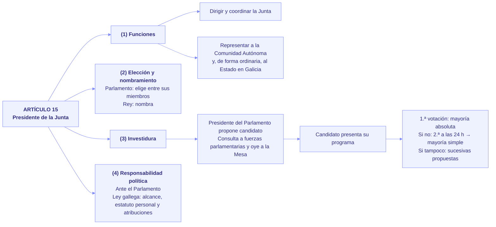
```mermaid
---
config:
  theme: base
  themeVariables:
    primaryColor: '#eef2ff'
    primaryBorderColor: '#818cf8'
    primaryTextColor: '#312e81'
    lineColor: '#818cf8'
---
flowchart LR
    H["<b>ARTÍCULO 15<br/>Presidente de la Junta</b>"]
    H --> A["<b>(1) Funciones</b>"]
    A --> A1["Dirigir y coordinar la Junta"]
    A --> A2["Representar a la Comunidad Autónoma<br/>y, de forma ordinaria, al Estado en Galicia"]
    H --> B["<b>(2) Elección y nombramiento</b><br/>Parlamento: elige entre sus miembros<br/>Rey: nombra"]
    H --> C["<b>(3) Investidura</b>"]
    C --> C1["Presidente del Parlamento propone candidato<br/>Consulta a fuerzas parlamentarias y oye a la Mesa"]
    C1 --> C2["Candidato presenta su programa"]
    C2 --> C3["1.ª votación: mayoría absoluta<br/>Si no: 2.ª a las 24 h → mayoría simple<br/>Si tampoco: sucesivas propuestas"]
    H --> D["<b>(4) Responsabilidad política</b><br/>Ante el Parlamento<br/>Ley gallega: alcance, estatuto personal y atribuciones"]
```
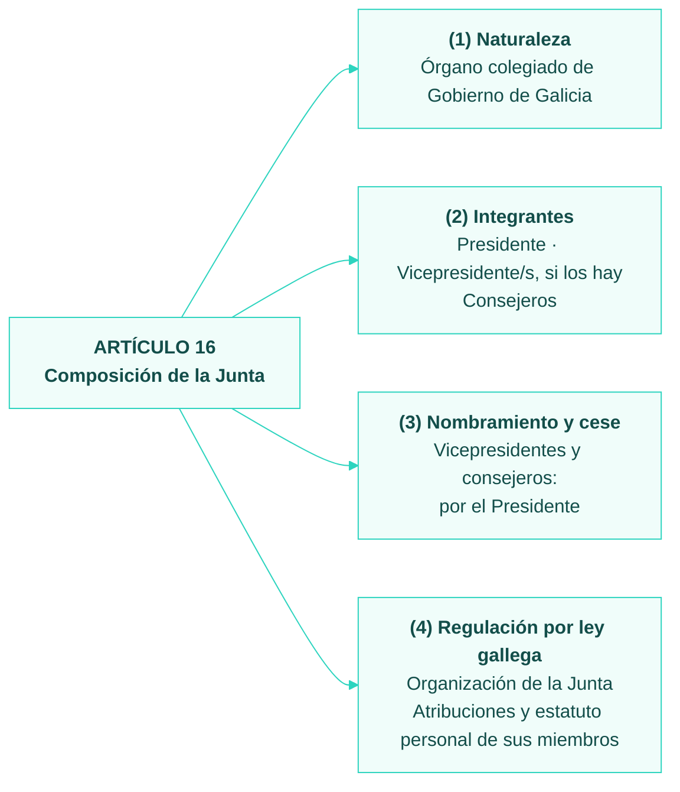
```mermaid
---
config:
  theme: base
  themeVariables:
    primaryColor: '#f0fdfa'
    primaryBorderColor: '#2dd4bf'
    primaryTextColor: '#134e4a'
    lineColor: '#2dd4bf'
---
flowchart LR
    H["<b>ARTÍCULO 16<br/>Composición de la Junta</b>"]
    H --> A["<b>(1) Naturaleza</b><br/>Órgano colegiado de Gobierno de Galicia"]
    H --> B["<b>(2) Integrantes</b><br/>Presidente · Vicepresidente/s, si los hay<br/>Consejeros"]
    H --> C["<b>(3) Nombramiento y cese</b><br/>Vicepresidentes y consejeros:<br/>por el Presidente"]
    H --> D["<b>(4) Regulación por ley gallega</b><br/>Organización de la Junta<br/>Atribuciones y estatuto personal de sus miembros"]
```
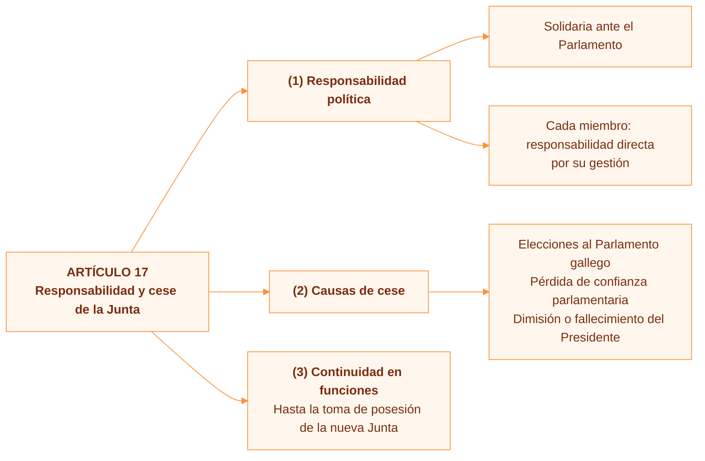
```mermaid
---
config:
  theme: base
  themeVariables:
    primaryColor: '#fff7ed'
    primaryBorderColor: '#fb923c'
    primaryTextColor: '#7c2d12'
    lineColor: '#fb923c'
---
flowchart LR
    H["<b>ARTÍCULO 17<br/>Responsabilidad y cese de la Junta</b>"]
    H --> A["<b>(1) Responsabilidad política</b>"]
    A --> A1["Solidaria ante el Parlamento"]
    A --> A2["Cada miembro: responsabilidad directa<br/>por su gestión"]
    H --> B["<b>(2) Causas de cese</b>"]
    B --> B1["Elecciones al Parlamento gallego<br/>Pérdida de confianza parlamentaria<br/>Dimisión o fallecimiento del Presidente"]
    H --> C["<b>(3) Continuidad en funciones</b><br/>Hasta la toma de posesión de la nueva Junta"]
```
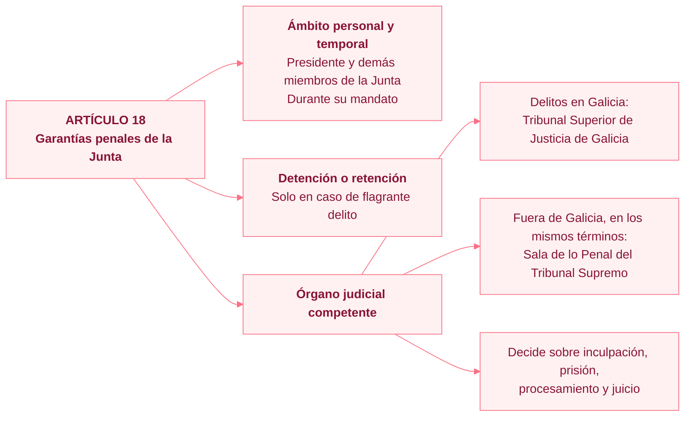
```mermaid
---
config:
  theme: base
  themeVariables:
    primaryColor: '#fff1f2'
    primaryBorderColor: '#fb7185'
    primaryTextColor: '#881337'
    lineColor: '#fb7185'
---
flowchart LR
    H["<b>ARTÍCULO 18<br/>Garantías penales de la Junta</b>"]
    H --> A["<b>Ámbito personal y temporal</b><br/>Presidente y demás miembros de la Junta<br/>Durante su mandato"]
    H --> B["<b>Detención o retención</b><br/>Solo en caso de flagrante delito"]
    H --> C["<b>Órgano judicial competente</b>"]
    C --> C1["Delitos en Galicia:<br/>Tribunal Superior de Justicia de Galicia"]
    C --> C2["Fuera de Galicia, en los mismos términos:<br/>Sala de lo Penal del Tribunal Supremo"]
    C --> C3["Decide sobre inculpación, prisión,<br/>procesamiento y juicio"]
```
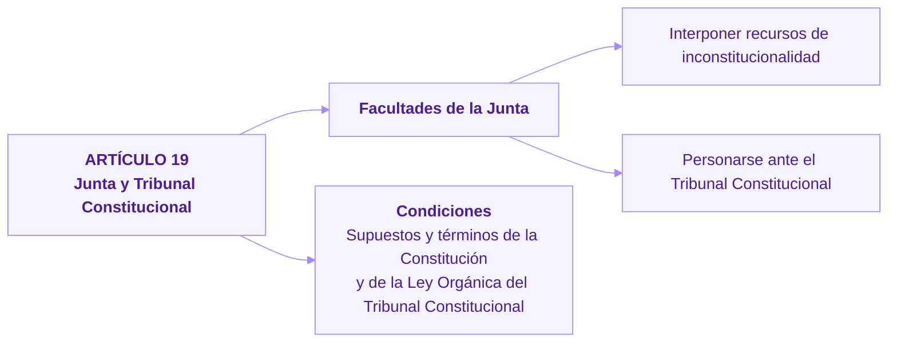
```mermaid
---
config:
  theme: base
  themeVariables:
    primaryColor: '#f5f3ff'
    primaryBorderColor: '#a78bfa'
    primaryTextColor: '#4c1d95'
    lineColor: '#a78bfa'
---
flowchart LR
    H["<b>ARTÍCULO 19<br/>Junta y Tribunal Constitucional</b>"]
    H --> A["<b>Facultades de la Junta</b>"]
    A --> A1["Interponer recursos de inconstitucionalidad"]
    A --> A2["Personarse ante el Tribunal Constitucional"]
    H --> B["<b>Condiciones</b><br/>Supuestos y términos de la Constitución<br/>y de la Ley Orgánica del Tribunal Constitucional"]
```
## CAP III: DE LA ADMINISTRACIÓN DE JUSTICIA EN GALICIA
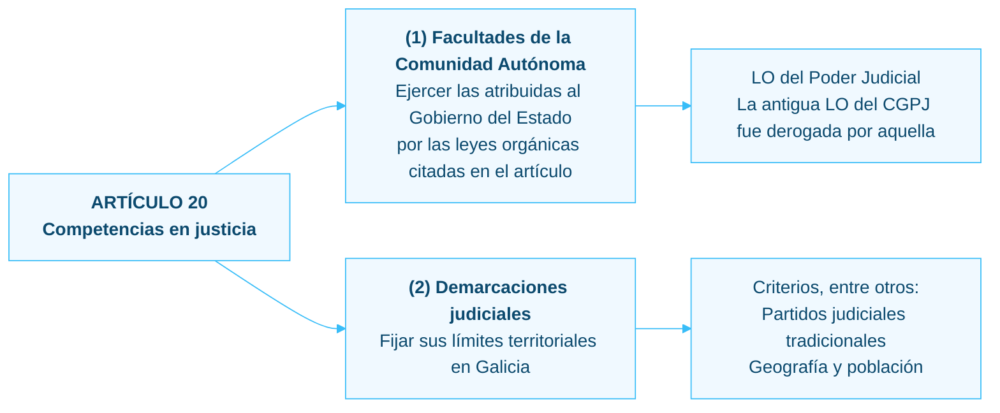
```mermaid
---
config:
  theme: base
  themeVariables:
    primaryColor: '#f0f9ff'
    primaryBorderColor: '#38bdf8'
    primaryTextColor: '#0c4a6e'
    lineColor: '#38bdf8'
---
flowchart LR
    H["<b>ARTÍCULO 20<br/>Competencias en justicia</b>"]
    H --> A["<b>(1) Facultades de la Comunidad Autónoma</b><br/>Ejercer las atribuidas al Gobierno del Estado<br/>por las leyes orgánicas citadas en el artículo"]
    H --> B["<b>(2) Demarcaciones judiciales</b><br/>Fijar sus límites territoriales en Galicia"]
    B --> B1["Criterios, entre otros:<br/>Partidos judiciales tradicionales<br/>Geografía y población"]
    A --> A1["LO del Poder Judicial<br/>La antigua LO del CGPJ fue derogada por aquella"]
```
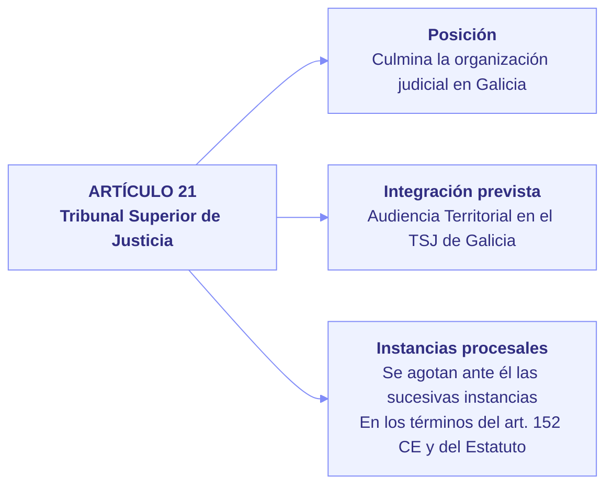
```mermaid
---
config:
  theme: base
  themeVariables:
    primaryColor: '#eef2ff'
    primaryBorderColor: '#818cf8'
    primaryTextColor: '#312e81'
    lineColor: '#818cf8'
---
flowchart LR
    H["<b>ARTÍCULO 21<br/>Tribunal Superior de Justicia</b>"]
    H --> A["<b>Posición</b><br/>Culmina la organización judicial en Galicia"]
    H --> B["<b>Integración prevista</b><br/>Audiencia Territorial en el TSJ de Galicia"]
    H --> C["<b>Instancias procesales</b><br/>Se agotan ante él las sucesivas instancias<br/>En los términos del art. 152 CE y del Estatuto"]
```
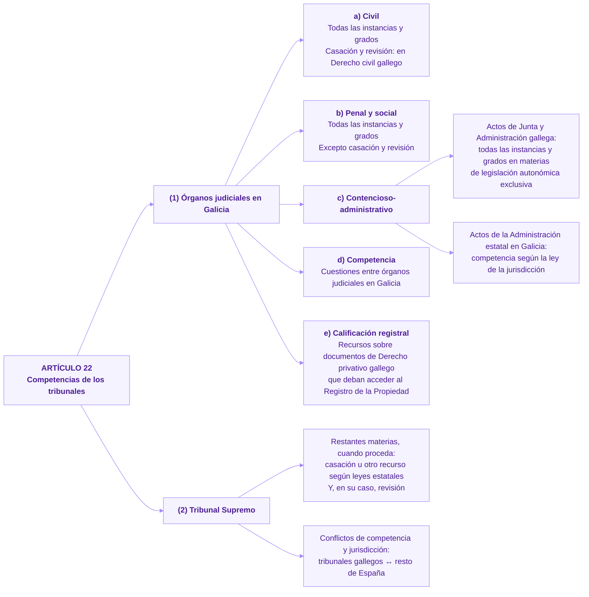
```mermaid
---
config:
  theme: base
  themeVariables:
    primaryColor: '#f5f3ff'
    primaryBorderColor: '#a78bfa'
    primaryTextColor: '#4c1d95'
    lineColor: '#a78bfa'
---
flowchart LR
    H["<b>ARTÍCULO 22<br/>Competencias de los tribunales</b>"]
    H --> A["<b>(1) Órganos judiciales en Galicia</b>"]
    A --> A1["<b>a) Civil</b><br/>Todas las instancias y grados<br/>Casación y revisión: en Derecho civil gallego"]
    A --> A2["<b>b) Penal y social</b><br/>Todas las instancias y grados<br/>Excepto casación y revisión"]
    A --> A3["<b>c) Contencioso-administrativo</b>"]
    A3 --> A31["Actos de Junta y Administración gallega:<br/>todas las instancias y grados en materias<br/>de legislación autonómica exclusiva"]
    A3 --> A32["Actos de la Administración estatal en Galicia:<br/>competencia según la ley de la jurisdicción"]
    A --> A4["<b>d) Competencia</b><br/>Cuestiones entre órganos judiciales en Galicia"]
    A --> A5["<b>e) Calificación registral</b><br/>Recursos sobre documentos de Derecho privativo gallego<br/>que deban acceder al Registro de la Propiedad"]
    H --> B["<b>(2) Tribunal Supremo</b>"]
    B --> B1["Restantes materias, cuando proceda:<br/>casación u otro recurso según leyes estatales<br/>Y, en su caso, revisión"]
    B --> B2["Conflictos de competencia y jurisdicción:<br/>tribunales gallegos ↔ resto de España"]
```
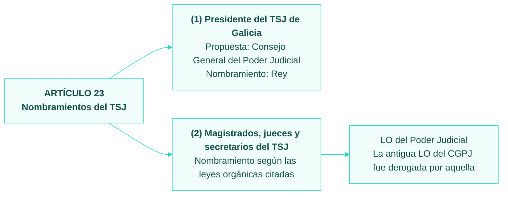
```mermaid
---
config:
  theme: base
  themeVariables:
    primaryColor: '#f0fdfa'
    primaryBorderColor: '#2dd4bf'
    primaryTextColor: '#134e4a'
    lineColor: '#2dd4bf'
---
flowchart LR
    H["<b>ARTÍCULO 23<br/>Nombramientos del TSJ</b>"]
    H --> A["<b>(1) Presidente del TSJ de Galicia</b><br/>Propuesta: Consejo General del Poder Judicial<br/>Nombramiento: Rey"]
    H --> B["<b>(2) Magistrados, jueces y secretarios del TSJ</b><br/>Nombramiento según las leyes orgánicas citadas"]
    B --> B1["LO del Poder Judicial<br/>La antigua LO del CGPJ fue derogada por aquella"]
```
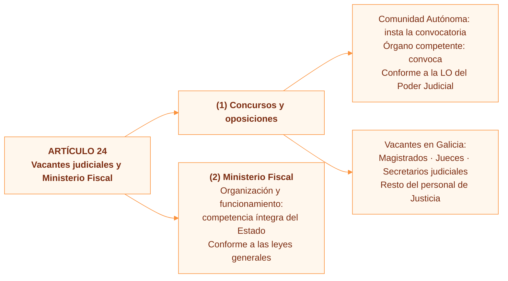
```mermaid
---
config:
  theme: base
  themeVariables:
    primaryColor: '#fff7ed'
    primaryBorderColor: '#fb923c'
    primaryTextColor: '#7c2d12'
    lineColor: '#fb923c'
---
flowchart LR
    H["<b>ARTÍCULO 24<br/>Vacantes judiciales y Ministerio Fiscal</b>"]
    H --> A["<b>(1) Concursos y oposiciones</b>"]
    A --> A1["Comunidad Autónoma: insta la convocatoria<br/>Órgano competente: convoca<br/>Conforme a la LO del Poder Judicial"]
    A --> A2["Vacantes en Galicia:<br/>Magistrados · Jueces · Secretarios judiciales<br/>Resto del personal de Justicia"]
    H --> B["<b>(2) Ministerio Fiscal</b><br/>Organización y funcionamiento:<br/>competencia íntegra del Estado<br/>Conforme a las leyes generales"]
```
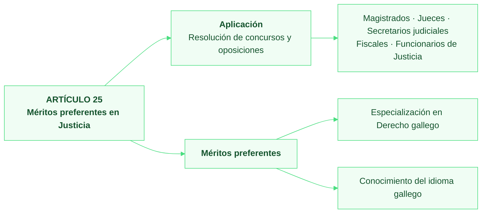
```mermaid
---
config:
  theme: base
  themeVariables:
    primaryColor: '#f0fdf4'
    primaryBorderColor: '#4ade80'
    primaryTextColor: '#14532d'
    lineColor: '#4ade80'
---
flowchart LR
    H["<b>ARTÍCULO 25<br/>Méritos preferentes en Justicia</b>"]
    H --> A["<b>Aplicación</b><br/>Resolución de concursos y oposiciones"]
    A --> A1["Magistrados · Jueces · Secretarios judiciales<br/>Fiscales · Funcionarios de Justicia"]
    H --> B["<b>Méritos preferentes</b>"]
    B --> B1["Especialización en Derecho gallego"]
    B --> B2["Conocimiento del idioma gallego"]
```
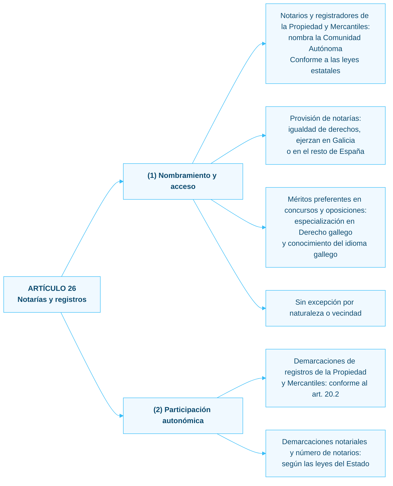
```mermaid
---
config:
  theme: base
  themeVariables:
    primaryColor: '#f0f9ff'
    primaryBorderColor: '#38bdf8'
    primaryTextColor: '#0c4a6e'
    lineColor: '#38bdf8'
---
flowchart LR
    H["<b>ARTÍCULO 26<br/>Notarías y registros</b>"]
    H --> A["<b>(1) Nombramiento y acceso</b>"]
    A --> A1["Notarios y registradores de la Propiedad y Mercantiles:<br/>nombra la Comunidad Autónoma<br/>Conforme a las leyes estatales"]
    A --> A2["Provisión de notarías:<br/>igualdad de derechos, ejerzan en Galicia<br/>o en el resto de España"]
    A --> A3["Méritos preferentes en concursos y oposiciones:<br/>especialización en Derecho gallego<br/>y conocimiento del idioma gallego"]
    A --> A4["Sin excepción por naturaleza o vecindad"]
    H --> B["<b>(2) Participación autonómica</b>"]
    B --> B1["Demarcaciones de registros de la Propiedad<br/>y Mercantiles: conforme al art. 20.2"]
    B --> B2["Demarcaciones notariales y número de notarios:<br/>según las leyes del Estado"]
```